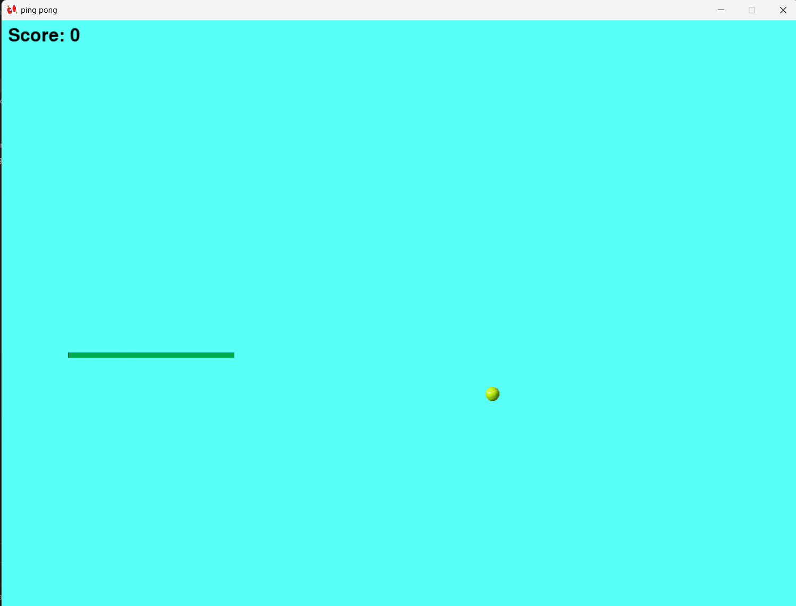

# Ping Pong

A simple 2D Ping Pong game built with Python and Pygame.
## Project Preview

### Gameplay



### Game Over


## Features

* Real-time paddle movement
* Ball physics and wall bouncing
* Collision detection between the ball and paddle
* Score tracking
* Random background color changes when the ball hits the paddle
* Sound effect when the ball hits the paddle
* Game-over detection
* Space key restart system
* Random ball starting position

## Controls

| Key         | Action                  |
| ----------- | ----------------------- |
| Left Arrow  | Move paddle left        |
| Right Arrow | Move paddle right       |
| Space       | Restart after losing    |
| Mouse Click | Change background color |

## Requirements

* Python 3.x
* Pygame

## Installation

Install Pygame:

```bash
pip install pygame
```

## Run

Start the game with:

```bash
python ping_pong.py
```

## Project Structure

```text
Ping-Pong/
│
├── ping_pong.py
└── sounds_and_pic/
    ├── Ping-pongeffect.mp3
    ├── pingpong.png
    ├── tennis_ball.png
    └── border.jpg
```

## How It Works

The game continuously updates the ball's position and checks for collisions with the screen boundaries and paddle.

When the ball hits the paddle, the score increases, a sound effect plays, and the background changes to a randomly generated RGB color.

When the ball reaches the bottom of the play area, the game ends. Pressing Space starts a new round with the ball appearing at a random position along the top.

## Technologies

* Python
* Pygame
